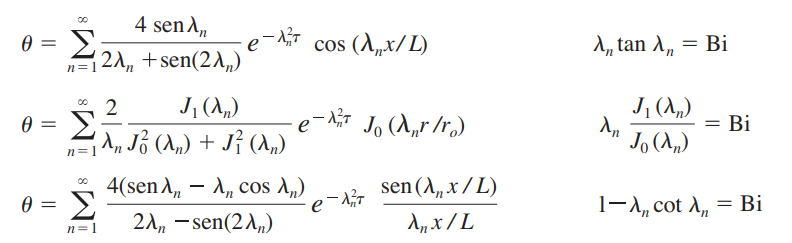
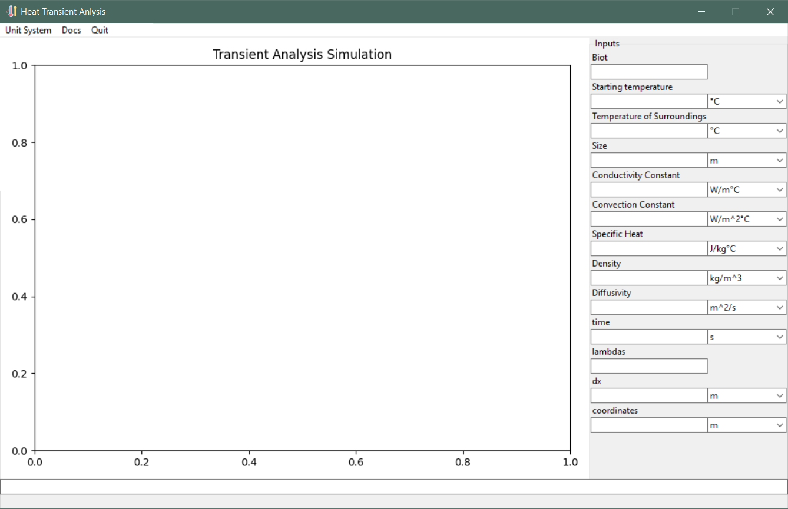

# Heat Transfer Transient Analysis
## About:

This program is designed to analyze spheres, walls and cilinders under transient heat transfer conditions. 
Transient analysis aims to study the change in temperature as a function of time and position. To
simplify the analysis, 3D bodies are anlyzed in one dimension under the assumption that there are uniform
conditions (the conduction and convetion constant don't change) and the bodies are solid objects of
one material, for cilinders this analysis is valid as long as the ratio L/r_o <ins>></ins> 10 [1]. 

The one dimensional analysis is done finding the values for the analytic solution of each body 
as shown


[1]

The lambdas/eigenvalues for the equations are obtained using Newton–Raphson method [2] and for the cilinder
a computation of Bessel functions was implemented [3].

## Installation
### Directly from the repo

Start your environment then run:

``` console
python -m pip install -e .
python main.py
```

### Windows users

The program is available in the section _**Releases**_ as an installer

## Usage

### General
Upon starting the application a window like the one shown below will appear.


To get started enter data in the *Inputs* section as prompted. Not every field has to have information as long 
as it can be computed with the rest of the information provided. For example the **Biot** can be computed using the
length, the convection constant and the conduction constat so if this information is provided there is no need
to provide the **Biot**.

### Fields and accepted inputs:

For big and small decimal values scientific notation can be used: 33.41e6, 14.5e-5.
If the field accepts decimal values it also accepts integer values.

- **Biot**: biot of the system. Adimensional value that indicates how energy flows through the system. Calculated
as: (convection)(size)/(condcution). Admits a decimal value.

- **Starting temperature**: temperature at time=0 of the system. Admits a decimal value.

- **Temperature of Surroundings**: temperature of the environment surrounding the body. Does not change through time.
Admits a decimal value.

- **Size**: for walls half the length of the wall (thickness). For cilinders and spheres it refers to the radius
(half the diameter to use as mnemonic). Admits a decimal value.

- **Conductivity Constant**: value that indicates how heat flows through the solid. Admits a decimal value.

- **Convection Constant**: value that indicates how heat flows between the solid and the surroundings.
Admits a decimal value.

- **Specific Heat**: value that indicates the amoun of energy required to increase the temperature of a given mass of the
material that constitutes the body. Admits a decimal value.

- **Density**: value that indicates the mass per volume of the material. Admits a decimal value.

- **Diffusivity**: value that indicates how fast energy diffuses through a body. Admits a decimal value.

- **time**: indicates the moment in which the temperatures will be calculated. Admits a decimal value,
additionaly a list of numbers separated by **,** can be used to indicate multiple instances (e.g., 1, 2.5, 10, 11..),
another acceptable entry for linearly spaced timestamps is using the following notation **_start_quantity_end** 
(e.g., _10_2_40 which will be interpreted as 10, 25, 40). If multiple instances of time are selected when the simulation
is run an animation will be presented (with the last frame ending as the static image) otherwise a static image of the
timestamp selected will present the temperature profile.

- **lambdas**: indicates the number of eigenvalues to use to solve for the temperatures. A higher number of lambdas lead to 
more precise results which are particularly important when the timestamp is close to cero and when the system has a high Biot
and/or high diffusivity. Accepts an integer value. More lambdas require more time to compute. The program has an upper limit
of **7** lambdas for cilinders and **100,000** for walls and spheres.

- **dx**: helps to determine the positions for wich the temperature will be calculated
(from the origin [position 0] until the size with as many differentials as can be fit in between). Accepts a decimal value. 

- **coordinates**: alternative method to indicate the position for which temperatures should be calculated. Accepts a list
of values and the linear spaced notation presented in **time**. If only one coordinate is selected to create the profile no
graphical temperature profile will be shown.

When executing the program the units of all fields will be changed to the standard of the system (which are the ones that appear selected when the system is changed)
The results will also be presented in this standard units. E.g., if the Mixed system is used results will always be in _°C_ and _m_.

### Running the program

To run the program acces the command shell at the bottom of the window and type **run -typ_  _x_** where _'x'_ is replaced by:
c, p, s. c indicates cilinder, s sphere and p wall.

#### Additional arguments

-sym (any character): will create a reflection of the profile when running the simulation. Since the analysis is 
done from the center of the sphere, wall or a cilinder to its surface this argument allows for the visualization of the entire
body.

-report (any character): will open the file explorer prompting a path where to save an html report that will be automatically opened.

#### Other commands
- q or quit: to close the app
- docs: to open the documentation

### Shortcuts
- <kbd>Alt</kbd>+<kbd>Up</kbd> sets focus on the command shell
- <kbd>Alt</kbd>+<kbd>1</kbd>...<kbd>9</kbd> and <kbd>Alt</kbd>+<kbd>asdf</kbd> sets focus on the input fields
- <kbd>Alt</kbd>+<kbd>Right</kbd> when focus is set on a field sets focus to the combobox to its right <kbd>Alt</kbd>+<kbd>Left</kbd>
sets the focus from the combobox to the field
- <kbd>Down</kbd> and <kbd>Up</kbd> help move focus from one field to another wrapping the cycle when at the end or at the start
- <kbd>Alt</kbd>+<kbd>q</kbd> close the app
- <kbd>Alt</kbd>+<kbd>d</kbd> open the documentation
- <kbd>Alt</kbd>+<kbd>u</kbd> change unit system

## References
1. Çengel, Y. A., & Klein, S. (2007). Heat and mass transfer: A practical approach (3. ed., SI units). McGraw-Hill.
2. Newton’s method. (2022). En Wikipedia. https://en.wikipedia.org/w/index.php?title=Newton%27s_method&oldid=1130151760
3. Bessel function. (2023). En Wikipedia. https://en.wikipedia.org/w/index.php?title=Bessel_function&oldid=1131439006
